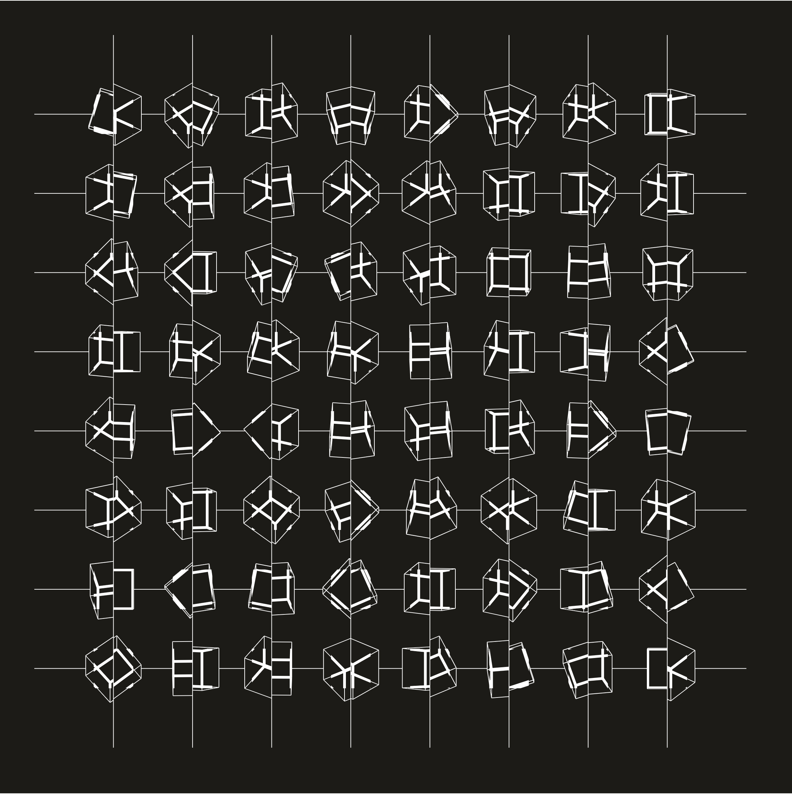

# cubic-limit

A remake of Manfred Mohr's [Cubic Limit](http://www.emohr.com/paris-1975/catalog/layoutcatalog75.html) using [graphics3d-ts](https://github.com/onur1/graphics3d-ts).

- [P-161](http://www.emohr.com/mohr_cube1_161.html)
- [P-197](http://www.emohr.com/mohr_cube2_197k.html)

